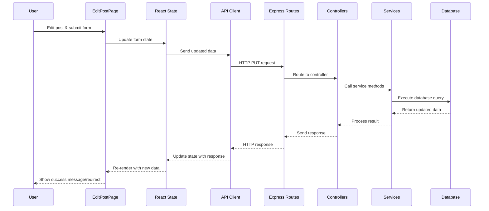

# Long Posts Explainer: Complete Data Flow

## Overview

This document provides an in-depth explanation of how post editing works in our application, tracing the complete data flow from the user interface through the frontend code, API calls, backend routes, controllers, services, and finally to the database.

🌟 **New Dev Friendly Explanation**:
When a user edits a post, data flows through several layers:
1. UI components capture user input
2. React state manages temporary data
3. API functions send data to the backend
4. Express routes receive the requests
5. Controllers validate and process the data
6. Services handle business logic
7. Database operations persist the changes
8. Responses flow back through the layers to update the UI

## Relevant Files

### Frontend Files
- **client/src/pages/post/editpost.tsx**: Main edit post page component with form and logic
- **client/src/api/posts.ts**: API client functions for post operations
- **client/src/components/input/data/TagInput.tsx**: Reusable component for tag management
- **client/src/router/index.tsx**: Router configuration that defines the edit post route
- **client/src/main.tsx**: Application entry point that sets up the router

### Backend Files
- **server/src/routes/postRoutes.ts**: Defines API endpoints for post operations
- **server/src/controllers/postController.ts**: Handles HTTP requests for posts
- **server/src/services/postService.ts**: Contains business logic for post operations
- **server/src/middlewares/auth.ts**: Authentication middleware to protect routes
- **server/prisma/schema.prisma**: Database schema definition including posts table

## Communication Flow Between Files

```
Frontend                                 Backend
┌─────────────────┐                     ┌─────────────────┐
│                 │                     │                 │
│  editpost.tsx   │                     │  postRoutes.ts  │
│  (React Page)   │                     │  (API Routes)   │
│                 │                     │                 │
└────────┬────────┘                     └────────┬────────┘
         │                                       │
         │ imports                               │ routes to
         ▼                                       ▼
┌─────────────────┐     HTTP Request     ┌─────────────────┐
│                 │─────────────────────▶│                 │
│    posts.ts     │                      │ postController  │
│  (API Client)   │◀─────────────────────│    (HTTP)       │
│                 │     HTTP Response    │                 │
└─────────────────┘                      └────────┬────────┘
                                                  │
                                                  │ calls
                                                  ▼
                                         ┌─────────────────┐
                                         │                 │
                                         │  postService    │
                                         │ (Business Logic)│
                                         │                 │
                                         └────────┬────────┘
                                                  │
                                                  │ uses
                                                  ▼
                                         ┌─────────────────┐
                                         │                 │
                                         │     Prisma      │
                                         │  (Database ORM) │
                                         │                 │
                                         └────────┬────────┘
                                                  │
                                                  │ queries
                                                  ▼
                                         ┌─────────────────┐
                                         │                 │
                                         │   PostgreSQL    │
                                         │   (Database)    │
                                         │                 │
                                         └─────────────────┘
```

> **Communication Clarification**: 
> 1. The frontend `posts.ts` API client communicates directly with the backend API endpoints defined in `postRoutes.ts`
> 2. The `postRoutes.ts` file routes the incoming HTTP requests to the appropriate controller methods in `postController.ts`
> 3. The API client does not communicate directly with the controller - all requests must go through the routes first
> 4. The routes act as the entry point for all HTTP requests in the backend

## Complete Flow Diagram



## 1. Frontend Implementation

### Post Interface Definition

The `editpost.tsx` file defines a TypeScript interface for the post data structure:

```typescript
// client/src/pages/post/editpost.tsx
interface Post {
  id?: string
  title: string
  description: string
  mediaUrl?: string
  tags: string[]
  likes?: number
  comments?: number
  created_at?: string
  updated_at?: string
  user_id?: string
  user?: {
    id: string
    username: string
    profile_image?: string
  }
}
```

This interface:
- Defines the shape of post data
- Makes `id` optional (for new posts)
- Requires `title`, `description`, and `tags`
- Makes other fields optional
- Includes nested user information

> **Communication Note**: This interface is used to type-check data throughout the frontend. It ensures that the data structure matches between the form state, API calls, and what the backend expects.

### Edit Post Page

In our application, the edit post functionality is implemented directly in the `editpost.tsx` file, which contains both the form UI and the logic for handling form state and submission.

```tsx
// client/src/pages/post/editpost.tsx
// Import React hooks for state management and side effects
import { useState, useEffect } from 'react';
// Import React Router hooks for navigation and URL parameters
import { useParams, useNavigate } from 'react-router-dom';
// Import layout component for consistent page structure
import Layout from '@/components/layout/Layout';
// Import UI components from shadcn
import { Button } from '@/components/ui/button';
import { Input } from '@/components/ui/input';
import { Textarea } from '@/components/ui/textarea';
// Import custom tag input component
import TagInput from '@/components/input/data/TagInput';
// Import API functions for post operations
import { fetchPost, updatePost } from '@/api/posts'; // ← Key import for frontend-backend communication

export default function EditPostPage() {
  // Get post ID from URL parameters using React Router
  const { id } = useParams<{ id: string }>(); // ← Gets post ID from URL
  const navigate = useNavigate();
  
  // State for the post data
  const [formData, setFormData] = useState<Post>({
    title: '',
    description: '',
    mediaUrl: '',
    tags: []
  });
  
  // UI state
  const [loading, setLoading] = useState(true);
  const [error, setError] = useState(null);
  const [submitting, setSubmitting] = useState(false);
  
  // Load the existing post data when component mounts or ID changes
  useEffect(() => {
    async function loadPost() {
      try {
        setLoading(true);
        const postData = await fetchPost(id); // ← Frontend-backend communication: API call to fetch post
        setFormData({
          title: postData.title,
          description: postData.description,
          mediaUrl: postData.mediaUrl || '',
          tags: postData.tags || []
        });
      } catch (err) {
        setError('Failed to load post');
        console.error(err);
      } finally {
        setLoading(false);
      }
    }

    loadPost();
  }, [id]);

  // Handle form field changes
  const handleChange = (e) => {
    const { name, value } = e.target;
    setFormData(prev => ({
      ...prev,
      [name]: value
    }));
  };
  
  // Handle tag changes using the TagInput component
  const handleTagsChange = (tags) => {
    setFormData(prev => ({
      ...prev,
      tags
    }));
  };

  // Handle form submission
  const handleSubmit = async (e) => {
    e.preventDefault();
    
    try {
      setSubmitting(true);
      await updatePost(id, formData); // ← Frontend-backend communication: API call to update post
      navigate(`/post/${id}`); // ← Redirects to post detail page on success
    } catch (err) {
      setError('Failed to update post');
      console.error(err);
    } finally {
      setSubmitting(false);
    }
  };

  if (loading) return <div>Loading...</div>;
  if (error) return <div>{error}</div>;

  return (
    <Layout>
      <div className="container mx-auto py-8">
        <h1 className="text-2xl font-bold mb-6">Edit Post</h1>
        
        <form onSubmit={handleSubmit} className="space-y-6">
          <div>
            <label htmlFor="title" className="block text-sm font-medium mb-1">
              Title
            </label>
            <Input
              id="title"
              name="title"
              value={formData.title}
              onChange={handleChange}
              required
            />
          </div>
          
          <div>
            <label htmlFor="description" className="block text-sm font-medium mb-1">
              Description
            </label>
            <Textarea
              id="description"
              name="description"
              value={formData.description}
              onChange={handleChange}
              rows={5}
              required
            />
          </div>
          
          <div>
            <label htmlFor="mediaUrl" className="block text-sm font-medium mb-1">
              Media URL (optional)
            </label>
            <Input
              id="mediaUrl"
              name="mediaUrl"
              value={formData.mediaUrl}
              onChange={handleChange}
            />
          </div>
          
          <div>
            <label className="block text-sm font-medium mb-1">
              Tags
            </label>
            <TagInput 
              tags={formData.tags} 
              onChange={handleTagsChange} 
            />
          </div>
          
          <Button type="submit" disabled={submitting}>
            {submitting ? 'Updating...' : 'Update Post'}
          </Button>
        </form>
      </div>
    </Layout>
  );
}
```

> **Communication Note**: The EditPostPage component:
> 1. Imports API functions from `posts.ts` to communicate with the backend
> 2. Uses `fetchPost()` to retrieve existing post data when the component mounts
> 3. Uses `updatePost()` to send updated data to the backend when the form is submitted
> 4. Both functions handle the HTTP communication details, allowing the component to focus on UI concerns

## 2. API Client Functions

The API client functions in `posts.ts` handle the HTTP communication between the frontend and backend.

```typescript
// client/src/api/posts.ts
// Import axios for making HTTP requests
import axios from 'axios';
// Import utility function to get the authentication token
import { getToken } from '@/utils/auth';

// Define the API base URL from environment variables
const API_URL = import.meta.env.VITE_API_URL || 'http://localhost:4100/api';

// Fetch a single post by ID
export const fetchPost = async (id: string) => {
  try {
    // Get authentication token
    const token = getToken();
    
    // Make GET request to the posts/:id endpoint
    const response = await axios.get(`${API_URL}/posts/${id}`, {
      headers: { 
        Authorization: `Bearer ${token}` // ← Include auth token in request
      }
    });
    
    // Return the post data from the response
    return response.data;
  } catch (error) {
    console.error(`Error fetching post ${id}:`, error);
    throw error;
  }
};

// Update an existing post
export const updatePost = async (id: string, postData: any) => {
  try {
    // Get authentication token
    const token = getToken();
    
    // Make PUT request to the posts/:id endpoint
    const response = await axios.put(`${API_URL}/posts/${id}`, postData, {
      headers: { 
        Authorization: `Bearer ${token}`, // ← Include auth token in request
        'Content-Type': 'application/json'
      }
    });
    
    // Return the updated post data from the response
    return response.data;
  } catch (error) {
    console.error(`Error updating post ${id}:`, error);
    throw error;
  }
};
```

> **Communication Note**: The API client functions:
> 1. Use axios to make HTTP requests to specific backend endpoints
> 2. Include authentication tokens in the request headers
> 3. Format the request data according to what the backend expects
> 4. Process the response data before returning it to the component
> 5. Handle and propagate errors that occur during communication
> 6. The requests go to routes defined in `postRoutes.ts` (e.g., `/api/posts/:id`), not directly to controllers

## 3. Backend Routes

The backend routes define the API endpoints and connect them to controller methods.

```typescript
// server/src/routes/postRoutes.ts
// Import Express router
import { Router } from 'express';
// Import controller methods
import * as postController from '../controllers/postController';
// Import authentication middleware
import { authenticate } from '../middlewares/auth';

const router = Router();

// Public routes
router.get('/', postController.getPosts);
router.get('/:id', postController.getPost);

// Protected routes (require authentication)
router.post('/', authenticate, postController.createPost);
router.put('/:id', authenticate, postController.updatePost); // ← Route for updating posts
router.delete('/:id', authenticate, postController.deletePost);
router.post('/:id/like', authenticate, postController.likePost);
router.post('/:id/comment', authenticate, postController.commentOnPost);

export default router;
```

> **Communication Note**: The routes file:
> 1. Defines the URL patterns that the API client functions call
> 2. Maps each URL pattern and HTTP method to a specific controller method
> 3. Applies middleware (like authentication) to protect certain routes
> 4. Acts as the entry point for all HTTP requests to the backend
> 5. The frontend's `updatePost()` function sends a PUT request to `/api/posts/:id`, which is routed to `postController.updatePost`

## 4. Backend Controller

The controller handles HTTP requests and responses, and delegates business logic to the service layer.

```typescript
// server/src/controllers/postController.ts
// Import Express types
import { Request, Response } from 'express';
// Import service functions
import * as postService from '../services/postService';

// Get a single post by ID
export const getPost = async (req: Request, res: Response) => {
  try {
    const { id } = req.params;
    const post = await postService.getPostById(id);
    
    if (!post) {
      return res.status(404).json({ message: 'Post not found' });
    }
    
    return res.json(post);
  } catch (error) {
    console.error('Error in getPost:', error);
    return res.status(500).json({ message: 'Server error' });
  }
};

// Update an existing post
export const updatePost = async (req: Request, res: Response) => {
  try {
    const { id } = req.params; // ← Get post ID from URL
    const userId = req.user.id; // ← Get user ID from authenticated request
    
    // Check if post exists
    const post = await postService.getPostById(id);
    if (!post) {
      return res.status(404).json({ message: 'Post not found' });
    }
    
    // Check if user owns the post
    if (post.user_id !== userId) {
      return res.status(403).json({ message: 'Not authorized to update this post' });
    }
    
    // Update the post using the service
    const updatedPost = await postService.updatePost(id, req.body);
    
    return res.json(updatedPost);
  } catch (error) {
    console.error('Error in updatePost:', error);
    return res.status(500).json({ message: 'Server error' });
  }
};
```

> **Communication Note**: The controller:
> 1. Receives HTTP requests from the routes
> 2. Extracts data from the request (params, body, user)
> 3. Performs authorization checks
> 4. Calls service methods to handle business logic
> 5. Formats and sends HTTP responses back to the client
> 6. The `updatePost` controller method is called when the frontend sends a PUT request to `/api/posts/:id`

## 5. Backend Service

The service layer contains business logic and interacts with the database.

```typescript
// server/src/services/postService.ts
// Import Prisma client
import { prisma } from '../lib/prisma';

// Get a post by ID
export const getPostById = async (id: string) => {
  try {
    const post = await prisma.posts.findUnique({
      where: { id },
      include: {
        users: {
          select: {
            id: true,
            username: true,
            profile_image: true
          }
        }
      }
    });
    
    if (!post) return null;
    
    // Transform post data for API response
    return {
      id: post.id,
      title: post.title,
      description: post.description,
      mediaUrl: post.mediaUrl,
      tags: post.tags,
      likes: post.likes,
      comments: post.comments,
      created_at: post.created_at,
      updated_at: post.updated_at,
      user_id: post.user_id,
      user: {
        id: post.users.id,
        username: post.users.username,
        profile_image: post.users.profile_image
      }
    };
  } catch (error) {
    console.error('Error in getPostById:', error);
    throw error;
  }
};

// Update a post
export const updatePost = async (id: string, data: any) => {
  try {
    const updatedPost = await prisma.posts.update({
      where: { id },
      data: {
        ...(data.title !== undefined && { title: data.title }),
        ...(data.description !== undefined && { description: data.description }),
        ...(data.mediaUrl !== undefined && { mediaUrl: data.mediaUrl }),
        ...(data.tags !== undefined && { tags: data.tags }),
        updated_at: new Date()
      },
      include: {
        users: {
          select: {
            id: true,
            username: true,
            profile_image: true
          }
        }
      }
    });
    
    // Transform post data for API response
    return {
      id: updatedPost.id,
      title: updatedPost.title,
      description: updatedPost.description,
      mediaUrl: updatedPost.mediaUrl,
      tags: updatedPost.tags,
      likes: updatedPost.likes,
      comments: updatedPost.comments,
      created_at: updatedPost.created_at,
      updated_at: updatedPost.updated_at,
      user_id: updatedPost.user_id,
      user: {
        id: updatedPost.users.id,
        username: updatedPost.users.username,
        profile_image: updatedPost.users.profile_image
      }
    };
  } catch (error) {
    console.error('Error in updatePost:', error);
    throw error;
  }
};
```

> **Communication Note**: The service layer:
> 1. Contains the business logic separate from HTTP concerns
> 2. Communicates with the database through Prisma
> 3. Transforms data between database format and API format
> 4. Handles database-specific error cases
> 5. Provides a clean interface for controllers to use
> 6. The controller calls `postService.updatePost()` which executes the database update operation

## 6. Router Configuration

The router configuration in the frontend defines the routes for the React application.

```typescript
// client/src/router/index.tsx
import { createBrowserRouter } from 'react-router-dom';
import Layout from '../components/layout/Layout';
import HomePage from '../pages/home/Home';
import PostPage from '../pages/post/post';
import EditPostPage from '../pages/post/editpost'; // ← Import the edit post page
import { ProtectedRoute } from './ProtectedRoute';

export const router = createBrowserRouter([
  {
    path: "/",
    element: <Layout />,
    children: [
      {
        path: "",
        element: <HomePage />,
      },
      {
        path: "post/:id",
        element: <PostPage />,
      },
      {
        path: "post/:id/edit",
        element: (
          <ProtectedRoute>
            <EditPostPage />
          </ProtectedRoute>
        ),
      },
      // Other routes...
    ]
  }
]);
```

> **Communication Note**: The router configuration:
> 1. Defines the URL patterns for the frontend application
> 2. Maps each URL pattern to a specific React component
> 3. Wraps certain routes in `ProtectedRoute` to require authentication
> 4. The `post/:id/edit` route renders the `EditPostPage` component when the URL matches
> 5. The `:id` parameter is extracted by the `useParams` hook in the component

## 7. Database Schema

The database schema defines the structure of the posts table and its relationships.

```prisma
// server/prisma/schema.prisma
model posts {
  id          String    @id @default(uuid())
  title       String
  description String
  mediaUrl    String?
  tags        String[]
  likes       Int       @default(0)
  comments    Int       @default(0)
  created_at  DateTime  @default(now())
  updated_at  DateTime  @default(now())
  user_id     String
  
  // Relation to users table
  users       users     @relation(fields: [user_id], references: [id], onDelete: Cascade)
  
  @@map("posts")
}
```

> **Communication Note**: The schema:
> 1. Defines the database structure that Prisma uses to generate its client
> 2. Establishes relationships between tables (like posts and users)
> 3. Sets constraints and defaults for fields
> 4. Serves as the foundation for all database operations
> 5. The service layer uses Prisma, which is generated based on this schema, to interact with the database

## 8. Authentication Middleware

The authentication middleware protects routes that require a logged-in user.

```typescript
// server/src/middlewares/auth.ts
import { Request, Response, NextFunction } from 'express';
import jwt from 'jsonwebtoken';

export const authenticate = (req: Request, res: Response, next: NextFunction) => {
  try {
    // Get token from Authorization header
    const authHeader = req.headers.authorization;
    
    if (!authHeader || !authHeader.startsWith('Bearer ')) {
      return res.status(401).json({ message: 'Authentication required' });
    }
    
    const token = authHeader.split(' ')[1];
    
    // Verify token
    const decoded = jwt.verify(token, process.env.JWT_SECRET);
    
    // Add user info to request object
    req.user = decoded;
    
    next();
  } catch (error) {
    return res.status(401).json({ message: 'Invalid token' });
  }
};
```

> **Communication Note**: The authentication middleware:
> 1. Intercepts requests before they reach the controller
> 2. Validates the JWT token from the Authorization header
> 3. Adds user information to the request object for controllers to use
> 4. Rejects unauthorized requests with appropriate status codes
> 5. Forms a security bridge between frontend and backend
> 6. The token is sent by the API client functions in the `Authorization` header

## 9. Detailed Data Flow Analysis

Let's trace the complete flow of data when a user edits a post:

### Step 1: User Navigates to Edit Page

1. User clicks "Edit" on a post
2. React Router navigates to `/post/:id/edit`
3. `EditPostPage` component mounts
4. `useEffect` hook triggers `loadPost` function
5. `fetchPost` API function is called with the post ID

### Step 2: Loading Existing Post Data

1. `fetchPost` makes a GET request to `/api/posts/:id`
2. Express routes the request to `postController.getPost`
3. Controller calls `postService.getPostById`
4. Service queries the database using Prisma
5. Database returns the post data
6. Service transforms the data for the API response
7. Controller sends the response back to the client
8. React component receives the data and sets it in state
9. Form fields are populated with the existing post data

### Step 3: User Edits the Post

1. User modifies form fields (title, description, etc.)
2. Each change triggers the appropriate handler function:
   - `handleChange` for text inputs
   - `handleTagsChange` for the tag input component
3. Form state is updated with the new values
4. UI reflects the changes as the user types

### Step 4: User Submits the Form

1. User clicks "Update Post"
2. Form `onSubmit` handler is triggered
3. `handleSubmit` function prevents default form submission
4. `setSubmitting(true)` updates UI to show loading state
5. `updatePost` API function is called with the post ID and form data

### Step 5: Sending Data to the Backend

1. `updatePost` makes a PUT request to `/api/posts/:id`
2. Request includes:
   - Authorization header with JWT token
   - JSON body with updated post data
3. Express routes the request to `postController.updatePost`
4. Authentication middleware validates the token
5. User ID is extracted from the token and added to the request

### Step 6: Backend Processing

1. Controller extracts post ID from URL parameters
2. Controller extracts user ID from the authenticated request
3. Controller calls `postService.getPostById` to check if post exists
4. Controller verifies the post belongs to the current user
5. Controller calls `postService.updatePost` with ID and data
6. Service constructs a Prisma query to update the post
7. Prisma executes the SQL UPDATE statement
8. Database updates the post record
9. Database returns the updated post data
10. Service transforms the data for the API response
11. Controller sends the response back to the client

### Step 7: Handling the Response

1. API client receives the successful response
2. `EditPostPage` component's `handleSubmit` function continues
3. `setSubmitting(false)` updates UI to remove loading state
4. `navigate` function redirects to the post detail page
5. User sees their updated post

### Step 8: Error Handling

If any errors occur during this process:
1. The appropriate catch block captures the error
2. Error is logged to the console
3. User-friendly error message is displayed
4. User can try again or navigate away

## 10. Key Concepts and Best Practices

### Separation of Concerns

- **React Components**: Handle UI rendering and user interaction
- **API Client**: Manages HTTP communication
- **Express Routes**: Define API endpoints
- **Controllers**: Process HTTP requests and responses
- **Services**: Contain business logic and database operations
- **Database**: Stores and retrieves data

### Type Safety

TypeScript interfaces ensure consistent data structures across the application:

```typescript
// Example of type definitions from editpost.tsx
interface Post {
  id?: string
  title: string
  description: string
  mediaUrl?: string
  tags: string[]
  likes?: number
  comments?: number
  created_at?: string
  updated_at?: string
  user_id?: string
  user?: {
    id: string
    username: string
    profile_image?: string
  }
}
```

### Authentication and Authorization

- JWT tokens are used for authentication
- Tokens are stored in localStorage on the client
- Tokens are sent in the Authorization header
- Backend middleware validates tokens
- Controllers check if users are authorized to modify resources

### Error Handling

- Try/catch blocks capture errors at each level
- Errors are logged for debugging
- User-friendly error messages are displayed
- HTTP status codes indicate the type of error

## 11. Summary

The post editing flow demonstrates how our application architecture handles user interactions and data persistence:

1. **React Components** capture user input and manage UI state
2. **API Client** functions handle communication with the backend
3. **Express Routes** define the API endpoints
4. **Controllers** process HTTP requests and call services
5. **Services** contain business logic and database operations
6. **Database** stores and retrieves data

This separation of concerns makes the codebase more maintainable, testable, and scalable. Each layer has a specific responsibility, and the data flows through these layers in a predictable way.

By understanding this flow, you can apply the same patterns to implement other features in the application. 