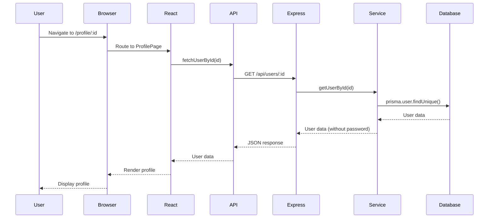
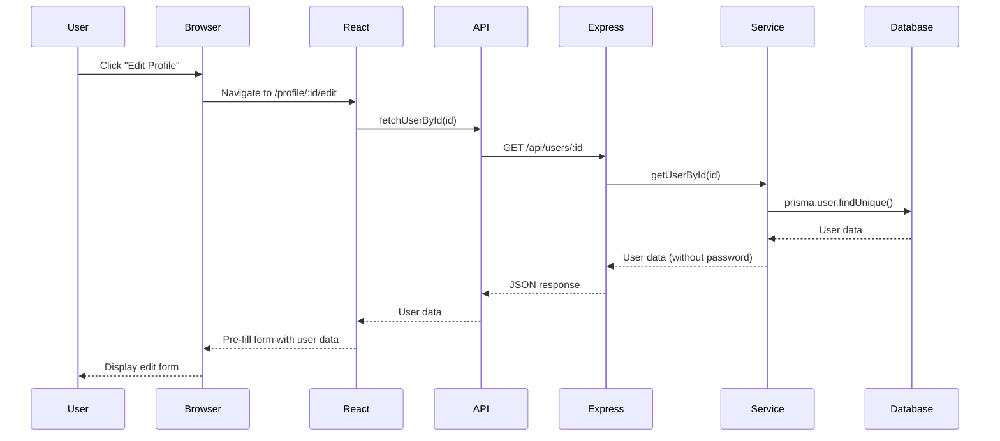
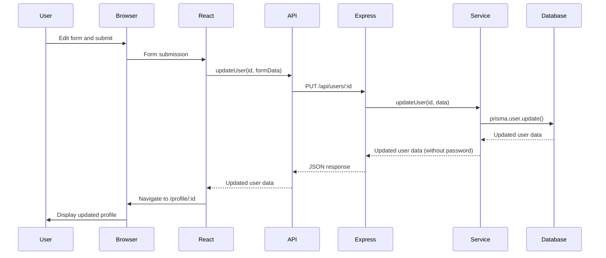

# Project Architecture: User Profile Example

## Overview

This document provides a practical example of our project architecture by walking through a complete user profile update flow. This example demonstrates how data flows through our application layers, from the database to the UI and back.

🌟 **New Dev Friendly Explanation**:
This guide shows how all the pieces of our application work together when a user updates their profile. We'll follow the data as it flows from the database to the form and back again, seeing exactly how each part of our architecture (React components, API calls, Express routes, and database operations) plays its role.

## The User Profile Update Flow

### User Story

> As a user, I want to edit my profile information so that I can keep my details up to date.

This involves:
1. Viewing my current profile information
2. Clicking an "Edit Profile" button
3. Seeing a form pre-filled with my current information
4. Making changes to my information
5. Saving the changes
6. Being redirected back to my profile page with updated information

## Application Components Involved

my-monorepo/
├── client/                           # Frontend React application
│   ├── src/
│   │   ├── pages/                    # Page components
│   │   │   ├── HomePage.tsx
│   │   │   ├── ProfilePage.tsx       # User profile display
│   │   │   └── EditProfilePage.tsx   # Profile editing form
│   │   ├── components/
│   │   │   ├── layout/
│   │   │   │   └── layout.tsx        # Main layout component
│   │   │   └── ui/                   # UI components
│   │   ├── api/
│   │   │   └── users.ts              # API client for user operations
│   │   ├── types/
│   │   │   └── user.ts               # TypeScript interfaces for user data
│   │   ├── router/
│   │   │   └── index.tsx             # React Router configuration
│   │   ├── App.tsx
│   │   └── main.tsx
│   └── package.json
│
├── server/                           # Backend Express application
│   ├── src/
│   │   ├── controllers/
│   │   │   └── userController.ts     # HTTP request handlers for users
│   │   ├── services/
│   │   │   └── userService.ts        # Business logic for user operations
│   │   ├── routes/
│   │   │   └── userRoutes.ts         # API endpoints for user operations
│   │   ├── middlewares/
│   │   │   └── auth.ts               # Authentication middleware
│   │   ├── types/
│   │   │   └── user.ts               # TypeScript interfaces for user data
│   │   ├── lib/
│   │   │   └── prisma.ts             # Prisma client initialization
│   │   └── index.ts                  # Main Express application
│   ├── prisma/
│   │   ├── schema.prisma             # Database schema definition
│   │   └── migrations/               # Database migrations
│   └── package.json
│
└── package.json                      # Root package.json for monorepo

### 1. Frontend Components

- **Pages**:
  - `ProfilePage.tsx`: Displays user profile
  - `EditProfilePage.tsx`: Form for editing profile

- **API Client**:
  - `users.ts`: Contains functions for fetching and updating user data

- **Router**:
  - `index.tsx`: Defines routes for profile pages

- **Types**:
  - `user.ts`: TypeScript interfaces for user data

### 2. Backend Components

- **Controllers**:
  - `userController.ts`: Handles HTTP requests for user operations

- **Services**:
  - `userService.ts`: Contains business logic for user operations

- **Routes**:
  - `userRoutes.ts`: Defines API endpoints for user operations

- **Database**:
  - PostgreSQL with Prisma ORM

## Step-by-Step Implementation

### 1. Frontend: Profile Page

First, we create a page to display the user's profile:

```tsx
// client/src/pages/ProfilePage.tsx
import { useState, useEffect } from "react";
import { useParams, Link } from "react-router-dom";
import Layout from "@/components/layout/layout";
import { fetchUserById } from "@/api/users";
import { User } from "@/types/user";

export default function ProfilePage() {
  const { id } = useParams<{ id: string }>();
  const [user, setUser] = useState<User | null>(null);
  const [loading, setLoading] = useState(true);
  const [error, setError] = useState<string | null>(null);

  useEffect(() => {
    async function loadUser() {
      try {
        setLoading(true);
        const userData = await fetchUserById(id!);
        setUser(userData);
      } catch (err) {
        setError("Failed to load user profile");
        console.error(err);
      } finally {
        setLoading(false);
      }
    }

    loadUser();
  }, [id]);

  // Render loading state, error state, or user profile
  if (loading) return <p>Loading profile...</p>;
  if (error) return <p className="text-red-500">{error}</p>;
  if (!user) return <p>User not found</p>;

  return (
    <Layout>
      <div className="container mx-auto py-8">
        <div className="bg-white shadow-md rounded-lg p-6">
          <h1 className="text-2xl font-bold mb-6">Profile</h1>
          
          <div className="grid grid-cols-1 md:grid-cols-2 gap-4 mb-6">
            <div>
              <p className="text-gray-600">Name</p>
              <p className="font-medium">{user.name}</p>
            </div>
            <div>
              <p className="text-gray-600">Email</p>
              <p className="font-medium">{user.email}</p>
            </div>
            {/* Other user details */}
          </div>
          
          <div className="flex justify-end">
            <Link 
              to={`/profile/${id}/edit`} 
              className="bg-blue-500 hover:bg-blue-600 text-white px-4 py-2 rounded"
            >
              Edit Profile
            </Link>
          </div>
        </div>
      </div>
    </Layout>
  );
}
```

### 2. Frontend: API Client Functions

Next, we create API client functions to communicate with the backend:

```typescript
// client/src/api/users.ts
import axios from 'axios';

const API_URL = import.meta.env.VITE_API_URL || 'http://localhost:3000/api';

// Fetch a user by ID
export async function fetchUserById(id: string) {
  const response = await axios.get(`${API_URL}/users/${id}`);
  return response.data;
}

// Update a user
export async function updateUser(id: string, userData: {
  name?: string;
  email?: string;
}) {
  const response = await axios.put(`${API_URL}/users/${id}`, userData, {
    headers: {
      'Authorization': `Bearer ${localStorage.getItem('token')}`
    }
  });
  return response.data;
}
```

### 3. Frontend: Edit Profile Form

Now, we create a form for editing the user's profile:

```tsx
// client/src/pages/EditProfilePage.tsx
import { useState, useEffect } from "react";
import { useParams, useNavigate } from "react-router-dom";
import Layout from "@/components/layout/layout";
import { fetchUserById, updateUser } from "@/api/users";

export default function EditProfilePage() {
  const { id } = useParams<{ id: string }>();
  const navigate = useNavigate();
  
  const [formData, setFormData] = useState({
    name: "",
    email: ""
  });
  
  const [loading, setLoading] = useState(true);
  const [saving, setSaving] = useState(false);
  const [error, setError] = useState<string | null>(null);

  // Load the user data when the component mounts
  useEffect(() => {
    async function loadUser() {
      try {
        setLoading(true);
        const user = await fetchUserById(id!);
        
        // Pre-fill the form with the user's current data
        setFormData({
          name: user.name,
          email: user.email
        });
      } catch (err) {
        setError("Failed to load user data");
        console.error(err);
      } finally {
        setLoading(false);
      }
    }

    loadUser();
  }, [id]);

  // Handle form input changes
  const handleChange = (e: React.ChangeEvent<HTMLInputElement>) => {
    const { name, value } = e.target;
    setFormData(prev => ({
      ...prev,
      [name]: value
    }));
  };

  // Handle form submission
  const handleSubmit = async (e: React.FormEvent) => {
    e.preventDefault();
    
    try {
      setSaving(true);
      await updateUser(id!, formData);
      navigate(`/profile/${id}`); // Redirect back to profile page
    } catch (err) {
      setError("Failed to update profile");
      console.error(err);
      setSaving(false);
    }
  };

  if (loading) return <p>Loading...</p>;

  return (
    <Layout>
      <div className="container mx-auto py-8">
        <div className="bg-white shadow-md rounded-lg p-6">
          <h1 className="text-2xl font-bold mb-6">Edit Profile</h1>
          
          {error && (
            <div className="bg-red-100 border border-red-400 text-red-700 px-4 py-3 rounded mb-4">
              {error}
            </div>
          )}
          
          <form onSubmit={handleSubmit}>
            <div className="mb-4">
              <label htmlFor="name" className="block text-gray-700 font-medium mb-2">
                Name
              </label>
              <input
                type="text"
                id="name"
                name="name"
                value={formData.name}
                onChange={handleChange}
                className="w-full px-3 py-2 border border-gray-300 rounded-md"
                required
              />
            </div>
            
            <div className="mb-6">
              <label htmlFor="email" className="block text-gray-700 font-medium mb-2">
                Email
              </label>
              <input
                type="email"
                id="email"
                name="email"
                value={formData.email}
                onChange={handleChange}
                className="w-full px-3 py-2 border border-gray-300 rounded-md"
                required
              />
            </div>
            
            <div className="flex justify-between">
              <button
                type="button"
                onClick={() => navigate(`/profile/${id}`)}
                className="bg-gray-300 hover:bg-gray-400 text-gray-800 px-4 py-2 rounded"
              >
                Cancel
              </button>
              
              <button
                type="submit"
                disabled={saving}
                className="bg-blue-500 hover:bg-blue-600 text-white px-4 py-2 rounded"
              >
                {saving ? "Saving..." : "Save Changes"}
              </button>
            </div>
          </form>
        </div>
      </div>
    </Layout>
  );
}
```

### 4. Frontend: Router Configuration

We add routes for the profile pages:

```tsx
// client/src/router/index.tsx
import { createBrowserRouter } from 'react-router-dom';
import HomePage from '../pages/HomePage';
import ProfilePage from '../pages/ProfilePage';
import EditProfilePage from '../pages/EditProfilePage';
// ...other imports

export const router = createBrowserRouter([
  {
    path: "/",
    element: <HomePage />,
  },
  {
    path: "/profile/:id",
    element: <ProfilePage />,
  },
  {
    path: "/profile/:id/edit",
    element: <EditProfilePage />,
  },
  // ...other routes
]);
```

### 5. Backend: User Controller

On the backend, we implement the controller for user operations:

```typescript
// server/src/controllers/userController.ts
import { Request, Response } from 'express';
import * as userService from '../services/userService';

export async function getUserById(req: Request, res: Response) {
  try {
    const { id } = req.params;
    const user = await userService.getUserById(id);
    
    if (!user) {
      return res.status(404).json({ message: 'User not found' });
    }
    
    res.json(user);
  } catch (error) {
    console.error('Error fetching user:', error);
    res.status(500).json({ message: 'Error fetching user' });
  }
}

export async function updateUser(req: Request, res: Response) {
  try {
    const { id } = req.params;
    const { name, email } = req.body;
    
    // Validate input
    if (!name && !email) {
      return res.status(400).json({ message: 'No update data provided' });
    }
    
    // Check if the user exists
    const existingUser = await userService.getUserById(id);
    if (!existingUser) {
      return res.status(404).json({ message: 'User not found' });
    }
    
    // Update the user
    const updatedUser = await userService.updateUser(id, { name, email });
    
    // Return the updated user
    res.json(updatedUser);
  } catch (error) {
    console.error('Error updating user:', error);
    res.status(500).json({ message: 'Error updating user' });
  }
}
```

### 6. Backend: User Service

The service layer handles business logic and database operations:

```typescript
// server/src/services/userService.ts
import prisma from '../lib/prisma';
import { UpdateUserInput, UserResponse } from '../types/user';

export async function getUserById(id: string): Promise<UserResponse | null> {
  const user = await prisma.user.findUnique({
    where: { id }
  });

  if (!user) return null;
  
  // Remove passwordHash from response
  const { passwordHash, ...userWithoutPassword } = user;
  return userWithoutPassword;
}

export async function updateUser(id: string, data: UpdateUserInput): Promise<UserResponse | null> {
  // Update the user in the database
  const user = await prisma.user.update({
    where: { id },
    data: {
      ...(data.name && { name: data.name }),
      ...(data.email && { email: data.email })
    }
  });

  // Remove passwordHash from response
  const { passwordHash, ...userWithoutPassword } = user;
  return userWithoutPassword;
}
```

### 7. Backend: User Routes

We define the API routes for user operations:

```typescript
// server/src/routes/userRoutes.ts
import express from 'express';
import * as userController from '../controllers/userController';
import { authenticate } from '../middlewares/auth';

const router = express.Router();

// Get user by ID
router.get('/:id', userController.getUserById);

// Update user (protected route)
router.put('/:id', authenticate, userController.updateUser);

export default router;
```

### 8. Backend: Authentication Middleware

We implement middleware to protect routes that require authentication:

```typescript
// server/src/middlewares/auth.ts
import { Request, Response, NextFunction } from 'express';
import jwt from 'jsonwebtoken';

export function authenticate(req: Request, res: Response, next: NextFunction) {
  const authHeader = req.headers.authorization;
  
  if (!authHeader || !authHeader.startsWith('Bearer ')) {
    return res.status(401).json({ message: 'Authentication required' });
  }
  
  const token = authHeader.split(' ')[1];
  
  try {
    const decoded = jwt.verify(token, process.env.JWT_SECRET!);
    req.user = decoded; // Attach user to request
    next();
  } catch (error) {
    return res.status(401).json({ message: 'Invalid token' });
  }
}
```

## Data Flow Analysis

Now let's analyze how data flows through our application during the profile update process:

### 1. Loading the Profile Page



### 2. Loading the Edit Form



### 3. Updating the Profile



## Key Architecture Concepts Demonstrated

### 1. Separation of Concerns

- **Frontend**:
  - Pages handle rendering and user interaction
  - API client functions handle communication with the backend
  - Router manages navigation between pages

- **Backend**:
  - Controllers handle HTTP requests and responses
  - Services contain business logic and database operations
  - Routes define API endpoints
  - Middleware handles cross-cutting concerns like authentication

### 2. Type Safety

TypeScript interfaces ensure consistent data structures across the application:

```typescript
// shared/types/user.ts
export interface User {
  id: string;
  name: string;
  email: string;
  role: 'admin' | 'user' | 'guest';
  joinDate: string;
}

export type UserResponse = Omit<User, 'passwordHash'>;

export interface UpdateUserInput {
  name?: string;
  email?: string;
}
```

### 3. State Management

React's useState and useEffect hooks manage component state:

- **Loading state**: Tracks when data is being fetched
- **Error state**: Captures and displays errors
- **User data state**: Stores the user information
- **Form state**: Manages form input values

### 4. Authentication and Authorization

- JWT tokens are used for authentication
- The `authenticate` middleware protects routes that require authentication
- Token is sent in the Authorization header

### 5. Error Handling

- Try/catch blocks capture errors
- Error states display user-friendly messages
- Console errors provide detailed information for debugging

## Best Practices Demonstrated

1. **Pre-filling Forms**: Loading existing data into forms for better user experience
2. **Loading States**: Showing loading indicators during async operations
3. **Error Handling**: Displaying user-friendly error messages
4. **Data Validation**: Validating input on both client and server
5. **Security**: Removing sensitive data (password hash) before sending to client
6. **Redirects**: Navigating users to appropriate pages after actions
7. **Consistent Styling**: Using Tailwind CSS for a cohesive UI

## Summary

This example demonstrates how our monorepo architecture handles a complete user flow from database to UI and back. By following the data through each layer of the application, we can see how the different components work together to create a seamless user experience.

The key takeaways are:

1. **Clear Separation of Concerns**: Each part of the application has a specific responsibility
2. **Type Safety**: TypeScript ensures consistent data structures
3. **Reusable Components**: Layout components provide consistent UI
4. **API Abstraction**: API client functions abstract backend communication
5. **Business Logic Isolation**: Services contain business logic separate from HTTP concerns
6. **Security**: Authentication middleware and data filtering protect sensitive information

By understanding this flow, you can apply the same patterns to implement other features in the application. 